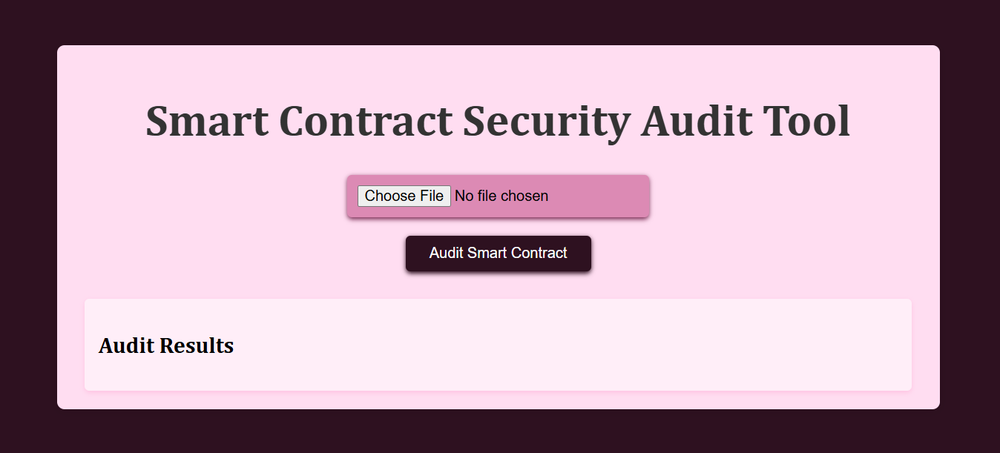

- **Company**: CODETECH IT SOLUTIONS
- **Name**: Lisha Angral
- **Intern ID**: CT08DS431
- **Domain**: Cybersecurity and Ethical Hacking
- **Batch Duration**: 5th Dec 2024 to 5th Jan 2025
- **Mentor Name**: Neela Santosh

--- 

# Blockchain Security Audit Tool

This repository contains a Blockchain Security Audit Tool designed to assist developers and auditors in evaluating the security of blockchain-based applications. The tool provides automated checks to identify common vulnerabilities and weaknesses in smart contracts and blockchain networks.



## Table of Contents
- [Introduction](#introduction)
- [Features](#features)
- [Live Demo](#live-demo)
- [Technologies Used](#technologies-used)
- [Setup and Installation](#setup-and-installation)
- [Usage](#usage)
- [How it works?](#how-it-works)
- [Contributing](#contributing)
- [License](#license)

## Introduction
The Blockchain Security Audit Tool aims to improve the security of blockchain applications by providing automated security analysis. It helps developers and security auditors identify potential vulnerabilities in smart contracts, network configurations,  and gas usage analysis. This tool allows users to upload Ethereum smart contract code. The website provides a simple and user-friendly interface for interacting with smart contracts without requiring deep technical knowledge.


## Features

- **Smart Contract Upload**: Users can upload their Ethereum smart contract code (in Solidity) for audit.
- **Vulnerability Detection**: The tool performs basic checks for known vulnerabilities in smart contract functions, such as reentrancy.
- **Gas Usage Analysis**: Provides a simulated gas usage report for smart contract functions, including common functions like `deposit` and `withdraw`.
- **Interactive User Interface**: The tool is designed with a simple interface to make it easy for anyone to audit their contracts.

## Live Demo
You can access the live version of the Blockchain Security Audit Tool here:  
[Blockchain Security Audit Tool Live Demo](https://lishaangral.github.io/blockchain-security-audit-tool/)

## Technologies Used

- **Frontend**: 
  - HTML
  - CSS
  - JavaScript (Web3.js library for blockchain interaction)

- **Backend (Simulated)**:
  - Web3.js (for interaction with blockchain)
  - Node.js (for backend logic simulation)

## Setup and Installation
1. Clone the repository to your local machine:
    ```bash
    git clone https://github.com/lishaangral/blockchain-security-audit-tool.git
    ```
2. Navigate to the project directory:
    ```bash
    cd blockchain-security-audit-tool
    ```
3. Open the `index.html` file in your web browser to start using the tool:
    ```bash
    open index.html
    ```

## Usage

1. **Visit the Website**: Open the following link in your browser: [Blockchain Security Audit Tool](https://lishaangral.github.io/blockchain-security-audit-tool/).
   
2. **Upload Your Smart Contract**:
   - Click the "Choose File" button to select your Ethereum smart contract file (Solidity code).
   - Once selected, the contract will be read, and the audit process will start automatically.
   
3. **View Audit Results**:
   - The tool will analyze the contract for common vulnerabilities such as reentrancy and access control issues.
   - It will also provide an estimate of the gas costs for the contract functions (like `deposit` and `withdraw`).
   - The results will be displayed on the page for you to review.

4. **Interpret the Results**:
   - **Vulnerabilities Detected**: Describes any potential issues found in the contract based on simple checks.
   - **Gas Cost Analysis**: Shows the estimated gas cost for functions like `deposit` and `withdraw`.

## How It Works

1. **Vulnerability Checks**: 
   The tool looks for common vulnerabilities in the contract, such as reentrancy issues (e.g., using `msg.sender.call`) and lack of access control for sensitive functions.

2. **Gas Usage**: 
   The tool estimates the gas cost for smart contract functions based on predefined simulated values. In future versions, this can be extended to fetch actual gas estimates from a blockchain test network.

3. **Interactive Interface**:
   The interface allows non-developers to upload contracts and view audit results with no coding required. It uses Web3.js to simulate contract interaction and display results dynamically.

## Contributing
Contributions are welcome! If you'd like to improve the tool, add more security checks, or fix bugs, feel free to fork the repository and submit a pull request. Before contributing, ensure:
- Your changes follow the repository's coding standards.
- You have tested your modifications thoroughly.

## License
This project is licensed under the MIT License. See the [LICENSE](LICENSE) file for more information.

---

